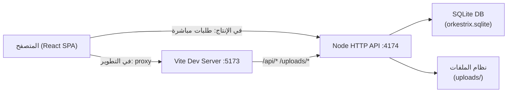

# تقرير فحص نظام Orkestrix

> تاريخ الفحص: 2026-08-25 | النظام: Monorepo — `apps/api` + `apps/web`

---

## 1. معمارية النظام — نظرة عامة



**المكونات الرئيسية:**
| الملف | الوظيفة |
|---|---|
| [`apps/api/src/server.ts`](file:///f:/Orkestrix.site/apps/api/src/server.ts) | الخادم — يخدم API والـ SPA والـ uploads من عملية واحدة |
| [`apps/api/src/database.ts`](file:///f:/Orkestrix.site/apps/api/src/database.ts) | قاعدة البيانات — SQLite عبر `node:sqlite` مع migration ذاتي |
| [`apps/api/src/security.ts`](file:///f:/Orkestrix.site/apps/api/src/security.ts) | الأمان — scrypt للكلمات، SHA-256 للـ session tokens |
| [`apps/web/src/lib/api.ts`](file:///f:/Orkestrix.site/apps/web/src/lib/api.ts) | عميل API للواجهة — `fetch` مع `credentials: same-origin` |
| [`apps/web/src/AdminApp.tsx`](file:///f:/Orkestrix.site/apps/web/src/AdminApp.tsx) | لوحة الإدارة الكاملة |

---

## 2. قراءة بيانات الوصول من `.env`

### ✅ ما يعمل بشكل صحيح

**الخلفية (API)** تقرأ المتغيرات التالية بشكل صحيح من [`server.ts` السطر 418–434](file:///f:/Orkestrix.site/apps/api/src/server.ts#L418-L434):

```typescript
ORKESTRIX_DATABASE_PATH  → مسار قاعدة البيانات
ORKESTRIX_UPLOADS_PATH   → مسار الرفع
ORKESTRIX_WEB_ROOT       → مسار ملفات الواجهة المبنية
ORKESTRIX_BOOTSTRAP_ADMIN_EMAIL    → إيميل المدير الأول
ORKESTRIX_BOOTSTRAP_ADMIN_PASSWORD → كلمة مرور المدير الأول
NODE_ENV                 → يتحكم في secureCookies
PORT                     → منفذ الاستماع (افتراضي: 4174)
HOST                     → عنوان الاستماع (افتراضي: 127.0.0.1)
```

**الواجهة (Vite/Web)** تقرأ:
```typescript
VITE_PROJECT_REQUEST_ENDPOINT → endpoint طلب المشروع (اختياري، افتراضي: /api/public/leads)
BASE_PATH                     → مسار الـ base للـ build
PORT                          → منفذ Vite dev server
```

---

## 3. التواصل بين الواجهة والخلفية والقاعدة

### ✅ يعمل بشكل صحيح

| المسار | الاتجاه | الآلية |
|---|---|---|
| `GET /api/public/services` | واجهة → خلفية → SQLite | مباشر |
| `GET /api/public/projects` | واجهة → خلفية → SQLite | مباشر |
| `POST /api/public/leads` | واجهة → خلفية → SQLite | مع rate-limit + honeypot |
| `POST /api/auth/login` | لوحة الإدارة → خلفية → SQLite | cookie-based session |
| `GET /api/admin/*` | لوحة الإدارة → خلفية → SQLite | محمي بجلسة |
| `/uploads/*` | واجهة → نظام الملفات | خدمة مباشرة من الخادم |

**في التطوير:** Vite يعمل كـ proxy لـ `/api` و `/uploads` إلى `http://127.0.0.1:4174`.

**في الإنتاج:** الخادم الواحد يخدم كل شيء (SPA + API + uploads).

---

## 4. الأخطاء والمشكلات المكتشفة

---

### 🔴 خطأ حرج — [server.ts السطر 425](file:///f:/Orkestrix.site/apps/api/src/server.ts#L425): مسار `ORKESTRIX_WEB_ROOT` الافتراضي خاطئ

**الكود الحالي:**
```typescript
webRoot: fromWorkspace(process.env.ORKESTRIX_WEB_ROOT, join(workspace, 'apps/web/dist/public')),
```

**المشكلة:** متغير `ORKESTRIX_WEB_ROOT` غير موجود في ملف [`.env`](file:///f:/Orkestrix.site/.env) ولا في [`.env.example`](file:///f:/Orkestrix.site/.env.example). عند عدم وجوده، يستخدم المسار الافتراضي `apps/web/dist/public` — لكن هذا المسار **لن يكون موجوداً** إلا بعد تشغيل `pnpm build`. في الإنتاج المباشر بدون بناء مسبق، ستظل خطأ 404 لكل الصفحات.

**الإصلاح:** إضافة `ORKESTRIX_WEB_ROOT` إلى `.env.example` مع توثيح أنه اختياري.

---

### 🟡 تحذير أمني — [.env السطر 3](file:///f:/Orkestrix.site/.env#L3): كلمة مرور حقيقية في `.env`

**المشكلة:**
```
ORKESTRIX_BOOTSTRAP_ADMIN_PASSWORD=Raeson124691
```
الملف `.env` يحتوي على **كلمة مرور حقيقية** للمدير. يجب أن يكون هذا الملف في `.gitignore`.

**التحقق:**

---

### 🟡 تحذير — [server.ts السطر 356](file:///f:/Orkestrix.site/apps/api/src/server.ts#L356): استخدام Dynamic `import()` داخل الـ handler

**الكود الحالي:**
```typescript
try { const { unlinkSync } = await import('node:fs'); unlinkSync(filePath); } catch {}
```

**المشكلة:** `import('node:fs')` داخل طلب HTTP بطيء وغير ضروري — `unlinkSync` موجودة بالفعل في import ثابت في أعلى الملف ([السطر 2](file:///f:/Orkestrix.site/apps/api/src/server.ts#L2)).

**الإصلاح:**
```typescript
// بدلاً من: const { unlinkSync } = await import('node:fs');
// استخدم مباشرة: unlinkSync(filePath) — مستوردة بالفعل في السطر 2
```

---

### 🟡 تحذير — [AdminApp.tsx السطر 112](file:///f:/Orkestrix.site/apps/web/src/AdminApp.tsx#L112): التوجيه يعتمد على `window.location.pathname` فقط

**المشكلة:** `AdminApp` يستخدم `window.location.pathname` بدون React Router. إذا ضغط المستخدم على زر Back في المتصفح، **لن يتحدث الـ UI** لأن React لن يُعيد الرسم.

**التأثير:** لوحة الإدارة تعمل فقط بالتنقل المباشر (Full page navigation) — وهذا قد يكون مقصوداً لكنه يعيق تجربة المستخدم.

---

### 🟡 تحذير — [data/projects.ts](file:///f:/Orkestrix.site/apps/web/src/data/projects.ts) و [data/services.ts](file:///f:/Orkestrix.site/apps/web/src/data/services.ts): بيانات ثابتة مكررة مع قاعدة البيانات

**المشكلة:** ملفات `data/projects.ts` و `data/services.ts` تحتوي على نسخ ثابتة من البيانات الموجودة في SQLite. هذه البيانات تُستخدم فقط كـ **types** في الواجهة، لكن وجود القيم الحقيقية فيها قد يسبب ارتباكاً — إذ قد يظن المطور أن هذه هي المصدر الحقيقي.

**الفعلي:** الواجهة تجلب البيانات من `/api/public/*` دائماً — الكود الثابت في `data/` يُستخدم فقط كـ type definitions وبيانات seed لا تُستهلك في runtime.

---

### 🟢 ملاحظة — [project-request.ts السطر 52](file:///f:/Orkestrix.site/apps/web/src/lib/project-request.ts#L52): قراءة `VITE_PROJECT_REQUEST_ENDPOINT` صحيحة

```typescript
const endpoint = import.meta.env.VITE_PROJECT_REQUEST_ENDPOINT?.trim() || '/api/public/leads';
```
يعمل بشكل صحيح. القيمة الافتراضية `/api/public/leads` مناسبة.

---

### 🟢 ملاحظة — [validation.ts](file:///f:/Orkestrix.site/apps/api/src/validation.ts): تعارض طفيف في التحقق من نوع المشروع

**في الواجهة** (`ContactPage.tsx`): الخيارات هي `موقع، متجر، لوحة إدارة، نظام مخصص، تكاملات وأتمتة، غير متأكد`.

**في الخلفية** (`server.ts`): حقل `projectType` يُقبل أي نص (2-80 حرفاً) — لا يتحقق من قائمة ثابتة.

هذا **مقصود** لمرونة المدخلات، لكن قد يسبب تضارباً في التحليل.

---

## 5. فحص `.gitignore`

---

## 6. ملخص المخاطر

| الأولوية | الخطر | الملف |
|---|---|---|
| 🔴 حرج | كلمة المرور الحقيقية في `.env` — يجب التحقق من عدم رفعها لـ git | `.env` |
| 🔴 حرج | Dynamic import غير ضروري في handler (أداء) | `server.ts:356` |
| 🟡 متوسط | `ORKESTRIX_WEB_ROOT` غير موثق في `.env.example` | `.env.example` |
| 🟡 متوسط | التوجيه في AdminApp لا يستجيب لزر Back | `AdminApp.tsx:112` |
| 🟢 منخفض | بيانات ثابتة مكررة في `data/` | `data/*.ts` |

---

## 7. التوصيات الفورية

1. **تحقق من `.gitignore`** — تأكد أن `.env` مدرج فيه ولم يُرفع للـ git repository
2. **أصلح Dynamic import** — استبدل `await import('node:fs')` بـ `unlinkSync` المستوردة مسبقاً
3. **أضف `ORKESTRIX_WEB_ROOT`** إلى `.env.example` مع شرح واضح
4. **بعد إنشاء حساب المدير** — احذف `ORKESTRIX_BOOTSTRAP_ADMIN_EMAIL` و `ORKESTRIX_BOOTSTRAP_ADMIN_PASSWORD` من `.env` (هذا مذكور في تعليق الملف نفسه)
